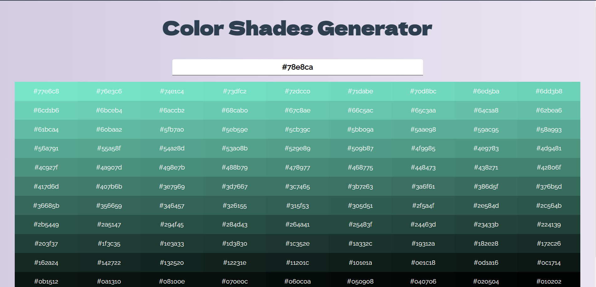

# React Color Shades App

This project was built using react and hosted on hereoku.
You can generate 100 different shades of your desired color
## Demo

https://colour-shades.netlify.app
  
## Deployment

To deploy this project run

```bash
  npm start
```


  
## Features

- 100 shades for a query
- Click to copy 
- Simple UI

  
## Screenshots



  
## Support

For support, email adihgr18@gmail.com

  
